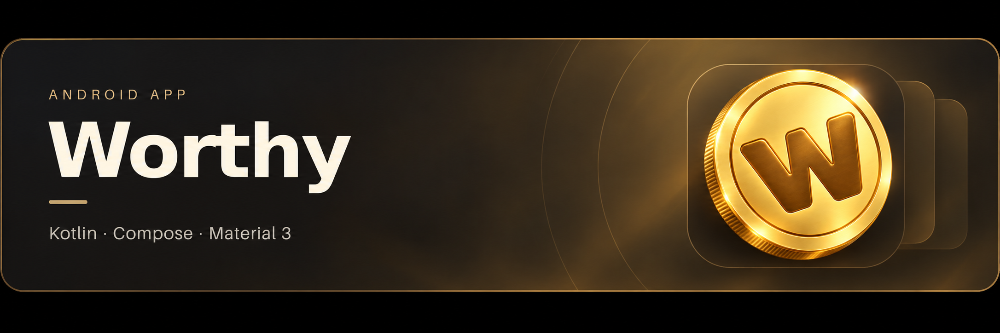

<p></p>

# Worthy · Guía avanzada

**Español** | [English](README.advanced.en.md) · [Inicio sencillo](../README.md)

Worthy es una aplicación Android de ahorro por objetivos. Crea un objetivo con el producto y su precio, registra aportaciones y consulta su avance. Admite varios objetivos en una interfaz de tarjetas y guarda los datos localmente.

## Versión y comprobaciones

La primera distribución corresponde a **1.0**, `versionCode = 1`, paquete `app.worthy.android`. El APK publicado es el archivo release proporcionado por el autor, sin recompilar ni modificar. Coincide byte a byte con el APK incluido en su proyecto.

Se ha verificado criptográficamente la firma APK v2 con la biblioteca oficial Android `apksig`, sin errores ni advertencias. El certificado no tiene el nombre habitual de depuración. La integridad del archivo puede contrastarse con `SHA256SUMS.txt` en la release.

Esta preparación incluye revisión estática del código y de los metadatos del APK. **No se ha ejecutado la app en un dispositivo o emulador, ni se han ejecutado las pruebas Gradle del proyecto aquí.** La firma válida no demuestra por sí sola el funcionamiento de todos los flujos.

## Tecnología y configuración

Valores leídos del proyecto publicado:

| Elemento | Valor |
|---|---|
| Plataforma / lenguaje | Android / Kotlin |
| Interfaz | Jetpack Compose y Material 3 |
| Datos / preferencias | Room 3 / DataStore |
| Navegación | Navigation 3 |
| Identificador / módulo | `app.worthy.android` / `app` |
| `minSdk` | 24, Android 7.0 |
| `compileSdk` / `targetSdk` | 37 / 37 |
| Android Gradle Plugin | 9.3.3 |
| Gradle / Kotlin | 9.5.0 / 2.2.10 |
| JDK del daemon / bytecode | 25 / Java 11 |
| Compose BOM / Room 3 | 2026.02.01 / 3.0.2 |

Conserva las versiones declaradas en `gradle/libs.versions.toml`, el wrapper y `gradle/gradle-daemon-jvm.properties`. La optimización release está desactivada en el proyecto entregado. No se han actualizado dependencias ni cambiado niveles SDK para publicar esta versión.

## Funciones

- Objetivos con nombre del producto, enlace opcional, precio objetivo y moneda.
- Inicio con tarjetas, detalle del objetivo y registro de aportaciones.
- Modo claro, oscuro o del sistema; colores dinámicos y estilos de color.
- Preferencias de moneda, vibraciones y alta frecuencia de refresco, según las posibilidades del dispositivo.
- Copias JSON y restauración de objetivos y aportaciones.

El enlace del producto se guarda como parte del objetivo. Esta versión no implementa extracción automática de precios ni acceso bancario. La interfaz tiene recursos de texto en inglés; los README están en español e inglés.

## Organización

| Ruta | Contenido |
|---|---|
| `app/src/main/` | Aplicación, manifiesto y recursos |
| `core/` dentro del paquete | Modelos, dinero, validación y vibraciones |
| `data/` | Room, repositorios, DataStore y copias |
| `feature/` | Inicio, crear objetivo, detalle, ajustes y tema |
| `navigation/`, `ui/`, `di/` | Navegación, componentes y composición de dependencias |
| `app/src/test/`, `app/src/androidTest/` | Pruebas unitarias e instrumentadas |
| `app/schemas/` | Esquema Room exportado, versión 1 |
| `gradle/`, `gradlew`, `gradlew.bat` | Catálogo, wrapper y configuración JVM |
| `docs/`, `assets/` | Documentación bilingüe y marca |

El repositorio conserva la estructura Gradle del original. Los directorios de compilación, cachés, configuración local del SDK y material privado de firma se excluyen. El APK está en Releases.

## Abrir y ejecutar

1. Descarga o clona el repositorio y abre la raíz en Android Studio.
2. Instala el SDK 37 y utiliza el JDK 25 indicado por la configuración del daemon.
3. Sincroniza Gradle y selecciona el módulo `app`.
4. Ejecuta la variante debug en un dispositivo o emulador con API 24 o posterior.

Windows PowerShell:

```powershell
.\gradlew.bat :app:assembleDebug
.\gradlew.bat :app:installDebug
```

macOS / Linux:

```bash
chmod +x gradlew
./gradlew :app:assembleDebug
./gradlew :app:installDebug
```

`installDebug` necesita un dispositivo conectado. Son comandos para el desarrollador, no comprobaciones ejecutadas durante la publicación.

## Datos y copias

El dinero se representa mediante unidades menores enteras `Long` y códigos de moneda ISO 4217. Room guarda objetivos y aportaciones en `WorthyDatabase`, versión 1. DataStore guarda preferencias.

La exportación utiliza JSON UTF-8 mediante el selector de archivos de Android. El formato 1 incluye versión, fecha de exportación, objetivos y aportaciones. La importación valida el documento y, tras confirmar, sustituye los datos actuales en una transacción Room. Consulta el [formato completo](backup-format.md).

El archivo JSON no se cifra por este exportador y contiene datos de tus objetivos y aportaciones. Guárdalo en un lugar privado. El manifiesto también habilita las copias del sistema Android, cuyo comportamiento depende del dispositivo y de sus ajustes. Esto no es una función propia de sincronización en la nube.

## Pruebas del proyecto

El código incluye pruebas para dinero, progreso, validaciones, copias, ajustes, repositorios, ViewModels, selección de tarjetas y temas. También incluye pruebas instrumentadas para Room y DataStore.

```powershell
.\gradlew.bat :app:testDebugUnitTest :app:lintDebug
.\gradlew.bat :app:connectedDebugAndroidTest
```

La última tarea necesita un dispositivo o emulador. Antes de una actualización, comprueba crear objetivos, añadir aportaciones, cambiar tarjetas, persistencia tras reiniciar, temas y exportación/restauración. Prueba también la variante release.

## Firma y actualizaciones

La [guía de firma](FIRMA_ANDROID.md) describe Android Studio y la comprobación del certificado. Mantén el identificador de aplicación y la clave de firma para actualizar instalaciones existentes; incrementa `versionCode` en versiones nuevas.

Las versiones debug suelen usar un certificado distinto. Antes de desinstalar para cambiar a release, exporta y conserva una copia: la desinstalación puede borrar datos locales. Nunca publiques claves privadas, almacenes `.jks` ni contraseñas.

## Autoría y licencia

Proyecto de **Manu / LogicGrove**. El proyecto recibido no contiene un archivo `LICENSE`; queda pendiente declarar la licencia de distribución del código. No se aplica automáticamente la licencia de Jade. Las dependencias mantienen sus propios avisos y licencias.

## Referencias oficiales

- [Compilar desde la línea de comandos](https://developer.android.com/build/building-cmdline)
- [Versionar una app](https://developer.android.com/studio/publish/versioning)
- [Firma Android](https://developer.android.com/studio/publish/app-signing)
- [Verificar un APK](https://developer.android.com/tools/apksigner)
